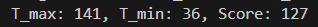

## Initial greedy cluster
使用greedy algorithm因為buffer的fanout越大其分攤下來的cost就越小，所以將整個pin腳視作集合，每次從中取出盡量多且滿足length要求的pin並以最大的buffer做連接，剩下的無法的納入的pin就把他單獨用一buffer連接
## DME
因為skew實際上最大值=Source distance - fartest pin，所以為了使最後的skew變小，我們可以犧牲一點cost來讓每個pin的T都盡量接近max(source,pin)，也就是DME的概念，所以此方法的CLUSTERING跟greedy的不一樣會挑選一個讓在此cluster內的max-min最小的位置